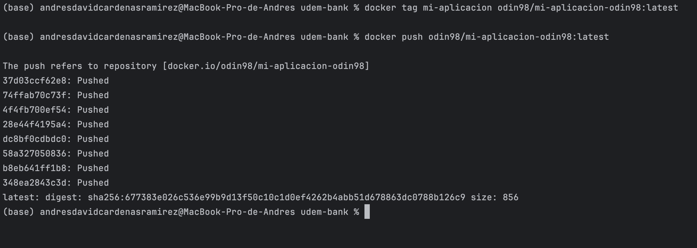
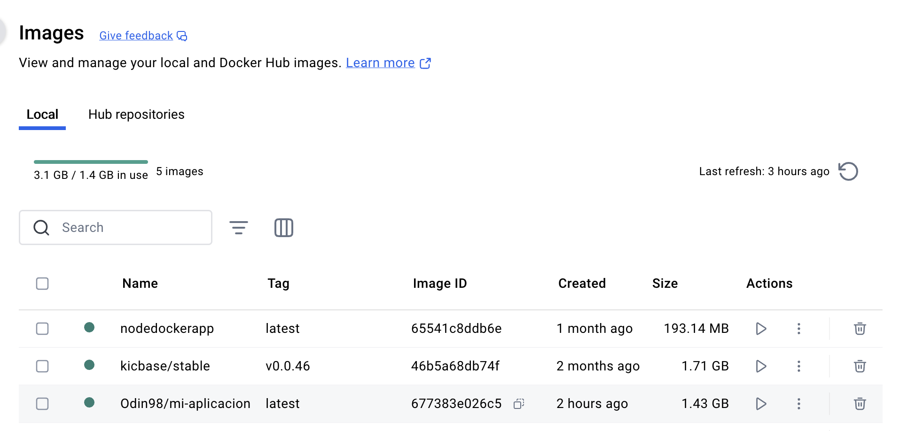
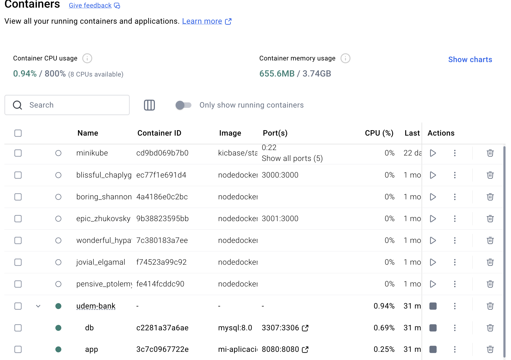
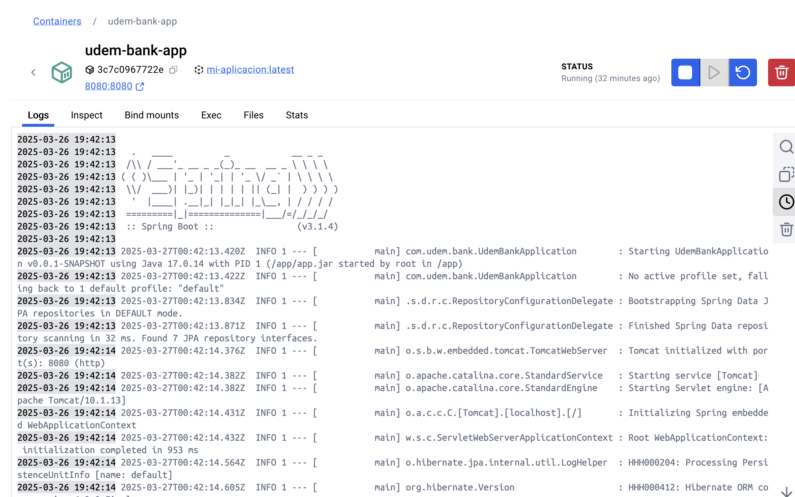
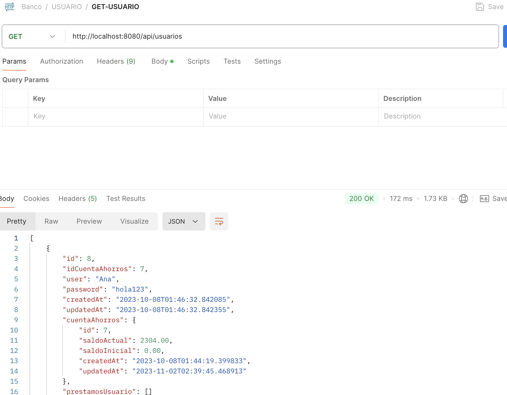

Link a DockerHub:

https://hub.docker.com/repository/docker/odin98/mi-aplicacion-odin98/general

Aqui podemos ver el push en la terminal para mandar la imagen a dockerhub:

Aqui podemos ver la imagene en Docker Desktop:

Aqui podemos ver los contenedores:

Aqui vemos la aplicacion de springboot corriendo en los contenedores:

Vemos las peticiones de la app a traves de postman:

